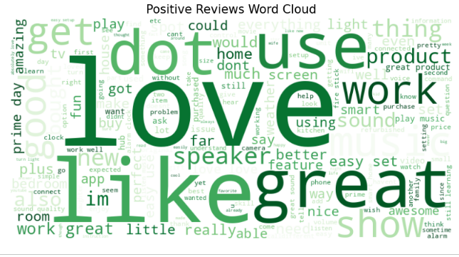
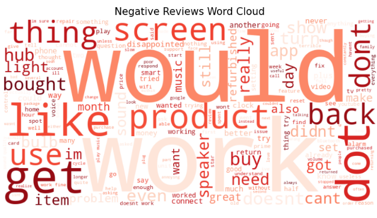

# Amazon Review Sentiment Analysis using NLP & Machine Learning


---

# Project Overview

Customer reviews contain valuable information about user experiences, satisfaction levels, and product quality. However, manually analyzing thousands of reviews is time-consuming and inefficient.

This project presents an **end-to-end Natural Language Processing (NLP) based Sentiment Analysis System** that automatically classifies Amazon customer reviews into sentiment categories.

The system applies NLP techniques to clean and process raw review text, extracts important textual features using **TF-IDF Vectorization**, trains a machine learning classification model, and deploys the final solution using an interactive **Streamlit web application**.

The deployed application allows users to enter a customer review and instantly receive sentiment predictions along with visual insights.

---

# Project Objectives

The main objectives of this project are:

- Analyze customer review data using Exploratory Data Analysis (EDA).
- Perform text cleaning and preprocessing using NLP techniques.
- Convert textual reviews into numerical features.
- Train a machine learning sentiment classification model.
- Evaluate model performance using classification metrics.
- Save trained model artifacts for deployment.
- Develop an interactive Streamlit application.
- Provide real-time sentiment prediction from user input.

---

# Problem Statement

Online platforms receive millions of customer reviews every day. Understanding customer feedback manually becomes difficult due to the huge volume of data.

The objective of this project is to build an automated system that can:

- Understand customer opinions.
- Identify sentiment patterns.
- Classify reviews automatically.
- Help businesses analyze customer satisfaction.

---

# Project Workflow

The complete workflow follows an end-to-end machine learning pipeline:

```
Dataset Collection
        |
        ↓
Data Exploration & Analysis
        |
        ↓
Text Cleaning & Preprocessing
        |
        ↓
Feature Extraction using TF-IDF
        |
        ↓
Machine Learning Model Training
        |
        ↓
Model Evaluation
        |
        ↓
Model Saving
        |
        ↓
Streamlit Deployment
        |
        ↓
Real-Time Sentiment Prediction
```

---

# Repository Structure

```
WEEK5_NLP_SENTIMENT_ANALYSIS/

│
├── notebooks/
│   └── week5_nlp.ipynb
│
├── data/
│   └── amazon_reviews.csv
│
├
│── sentiment_model.pkl
│── tfidf_vectorizer.pkl
│
├── 1.png
│── 2.png
│
├── app.py
│
├── utils.py
│
├── style.css
│
├── requirements.txt
│
└── README.md

```

---

# Dataset Description

The project uses an Amazon Reviews dataset containing customer-written feedback.

The dataset consists of:

| Feature | Description |
|---------|-------------|
| Review Text | Written customer feedback |
| Sentiment | Sentiment label assigned to review |

The dataset is used to train a supervised learning model that learns patterns from existing reviews and predicts sentiment for new unseen reviews.

---

# Technologies Used

## Programming Language

- Python


## Data Processing

- Pandas
- NumPy


## Natural Language Processing

- NLTK
- Regular Expressions (Regex)


## Machine Learning

- Scikit-learn


## Visualization

- Matplotlib
- Plotly
- WordCloud


## Deployment

- Streamlit


## Model Serialization

- Joblib


---

# Exploratory Data Analysis (EDA)

Before model training, detailed analysis was performed to understand the dataset.

EDA includes:

## Dataset Understanding

Performed analysis of:

- Dataset shape
- Data types
- Feature information
- Statistical summary


## Missing Value Analysis

Checked for:

- Null values
- Data inconsistencies
- Missing information


## Sentiment Distribution Analysis

Analyzed:

- Number of positive reviews
- Number of negative reviews
- Class balance


## Text Analysis

Generated insights using:

- Word frequency analysis
- WordCloud visualization
- Review length analysis


EDA helped identify important patterns and prepare the dataset for machine learning.

---

# Natural Language Processing Pipeline

## 1. Text Cleaning

Raw customer reviews usually contain unnecessary information such as:

- Uppercase characters
- Special symbols
- URLs
- Extra spaces
- Noise characters


The preprocessing pipeline performs:

### Lowercase Conversion

Example:

Before:

```
THIS PRODUCT IS AMAZING
```

After:

```
this product is amazing
```


### Removing Special Characters

Example:

Before:

```
Amazing product!!! 100%
```

After:

```
amazing product
```


### Text Normalization

The cleaned reviews are prepared for feature extraction.

---

# Feature Engineering using TF-IDF

Machine learning algorithms cannot directly process text.

Therefore, the cleaned reviews are converted into numerical vectors using:

## TF-IDF (Term Frequency-Inverse Document Frequency)

TF-IDF calculates the importance of words by considering:

### Term Frequency (TF)

How frequently a word appears in a review.

### Inverse Document Frequency (IDF)

How important a word is across the complete dataset.


The output is a numerical representation of reviews that can be processed by machine learning algorithms.

---

# Machine Learning Model

A supervised learning approach was used for sentiment classification.

## Model Used

### Logistic Regression


Logistic Regression was selected because:

- It performs efficiently for text classification.
- It handles high-dimensional TF-IDF features effectively.
- It provides a strong baseline for sentiment analysis.


---

# Model Training Process

The training pipeline includes:

1. Splitting dataset into training and testing sets.
2. Transforming text data using TF-IDF.
3. Training classification model.
4. Evaluating predictions.
5. Saving trained model.


Saved files:

```


├── sentiment_model.pkl

└── tfidf_vectorizer.pkl
```

These files are loaded during deployment for real-time prediction.

---

# Model Evaluation

The model performance is evaluated using:


## Accuracy

Measures the percentage of correctly classified reviews.


## Precision

Measures how many predicted sentiment classes were actually correct.


## Recall

Measures how many actual sentiment samples were correctly identified.


## F1 Score

Provides a balance between precision and recall.


Complete evaluation results are available in:

```
notebooks/week5_nlp.ipynb
```

---

# Streamlit Web Application

The trained NLP model is deployed using Streamlit.

The application provides a user-friendly interface where users can enter custom reviews.

## Application Features

### Review Input

Users can provide any customer review.

Example:

```
The product quality is excellent and I really love it.
```


### Prediction Pipeline

```
User Review

↓

Text Cleaning

↓

TF-IDF Transformation

↓

Machine Learning Model

↓

Sentiment Prediction

```


### Visualization Features

The dashboard includes:

- Sentiment prediction result
- Interactive charts
- WordCloud visualization
- Customized styling using CSS

---

# Application Screenshots

## Dashboard Interface




## Prediction Output




---

# Installation and Setup

Follow these steps to run the project locally.

---

## 1. Clone Repository

```bash
git clone <repository-link>
```

---

## 2. Navigate to Project Directory

```bash
cd WEEK5_NLP_SENTIMENT_ANALYSIS
```

---

## 3. Create Virtual Environment

```bash
python -m venv venv
```

Activate environment:


### Windows

```bash
venv\Scripts\activate
```

---

## 4. Install Required Dependencies

```bash
pip install -r requirements.txt
```

---

## 5. Run Streamlit Application

```bash
streamlit run app.py
```

The application will open automatically in your browser.

---

# File Description

| File | Description |
|------|-------------|
| `app.py` | Main Streamlit application |
| `utils.py` | Text preprocessing functions |
| `style.css` | Custom application styling |
| `week5_nlp.ipynb` | Complete NLP workflow and model development |
| `amazon_reviews.csv` | Dataset |
| `sentiment_model.pkl` | Saved trained ML model |
| `tfidf_vectorizer.pkl` | Saved TF-IDF transformer |
| `requirements.txt` | Required Python packages |


---

# Requirements

Main dependencies:

```
streamlit
pandas
numpy
scikit-learn
nltk
joblib
matplotlib
plotly
wordcloud
```

Install all dependencies using:

```bash
pip install -r requirements.txt
```

---

# Key Learning Outcomes

Through this project, the following concepts were implemented:

- Natural Language Processing fundamentals
- Text preprocessing techniques
- Feature extraction using TF-IDF
- Machine learning text classification
- Model evaluation
- Model serialization
- Streamlit deployment
- Interactive dashboard development


---

# Future Improvements

Possible future enhancements:

- Implement advanced deep learning models.
- Use Transformer architectures such as BERT.
- Add multi-class sentiment classification.
- Perform hyperparameter optimization.
- Deploy application on cloud platforms.
- Add real-time review analytics.


---

# Author

## Ayesha Qamar

AI/ML Intern  
IT Simplera Solutions


---

# Project Status

Completed

This project demonstrates a complete NLP pipeline starting from raw customer reviews to a deployed machine learning application capable of performing real-time sentiment analysis.
